# Image based Localization and Tracking of a Continuum Flexible Robot

## Intro

In this project,  a vision-based system is designed to achieve tracking and shape estimation of Concentric Tube Robot (CTR) based on binocular stereo images.  The system consists of two main stages which are segmentation and 3D reconstruction. The CTR is firstly segmented from stereo image pair by background removal techniques.  Then epipolar geometry constraints in binocular stereo vision are applied to reconstruct robot 3D shape.  The structure of CTR is shown in figure below.

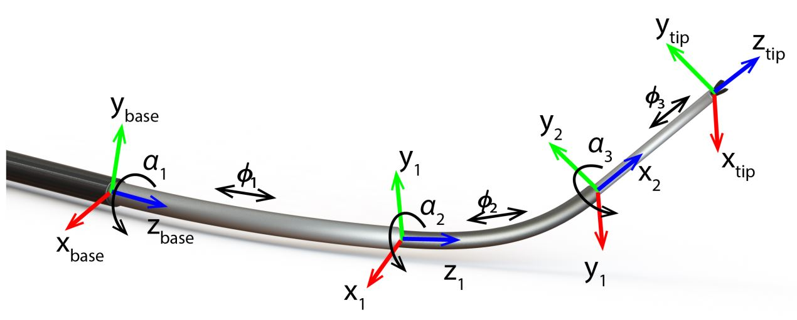

## Dependencies

- Python 3.7
- OpenCV 3.4
- Scikit-learn

## Dataset

Dataset contains 800 image pairs taken by two camera from different views. Ground truth label are given as the length of each tube. Information of grid template is also given. The circle diameter is 6.8 mm and distance between two adjacent dots is 18.2 mm. An example of two view images are shown below.

**Left view image**

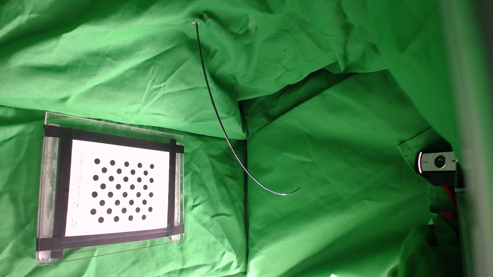

**Right view image**

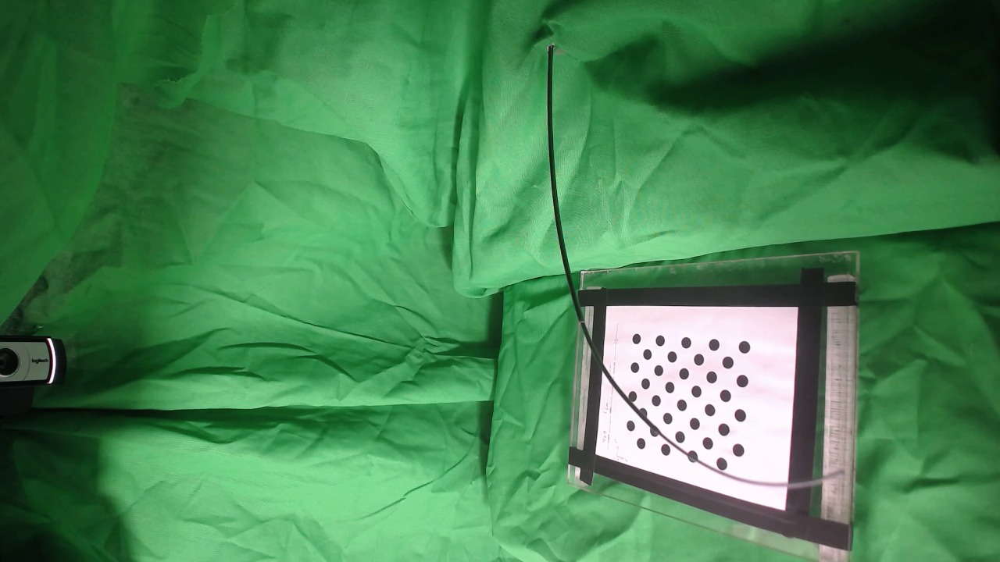

## Single Camera Calibration

Calibration is done using Zhang's method which is integrated in OpenCV library. Circle locations are obtained by blob detector. Chessboard plots are shown below. 

​      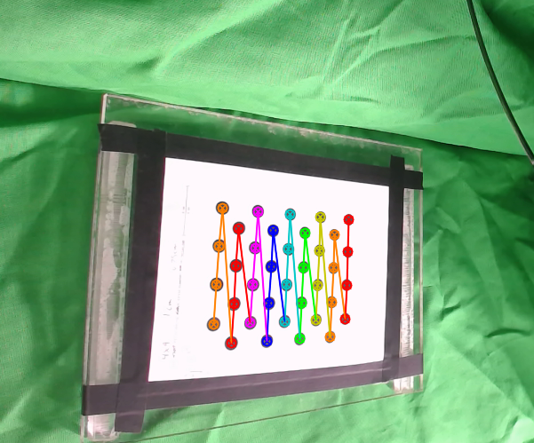             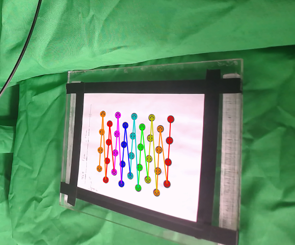 

## Image Segmentation

1. Original Image

   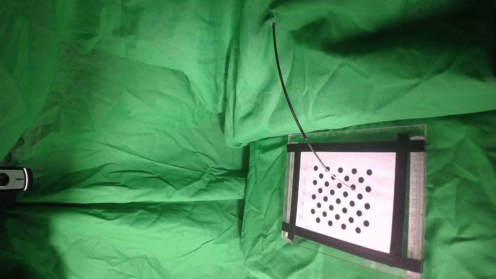

2. Results from Otsu Thresholding followed by morphological operation

   

3. Post-processing by RANSAC with polynomial regression of degree 7

   

## Geometric Constraints Calculation

1. Collecting corresponding points by prior knowledge. Here we label ending points and joint points as reliable correspondences.

   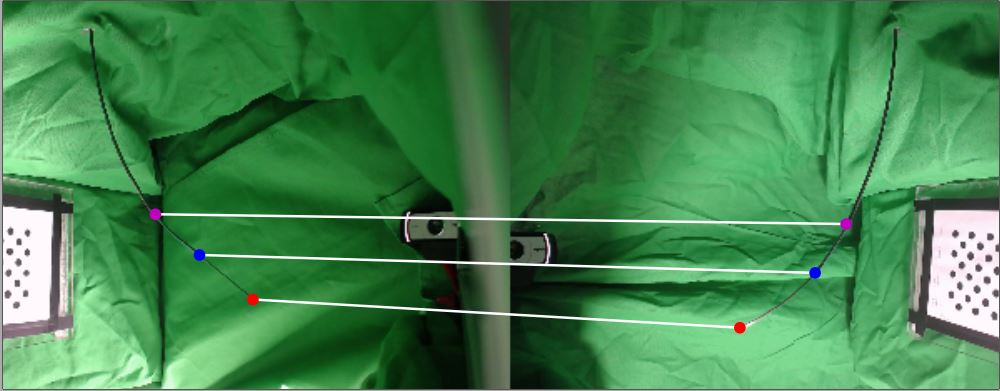

   

2. Recovered camera transformations

   

   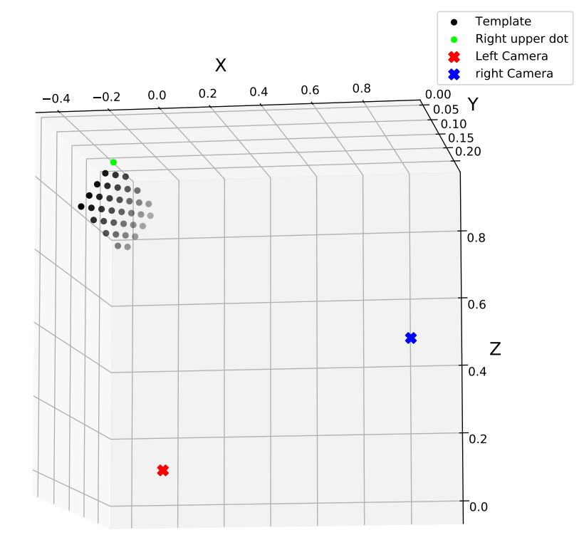

3. Verification on epipolar lines

   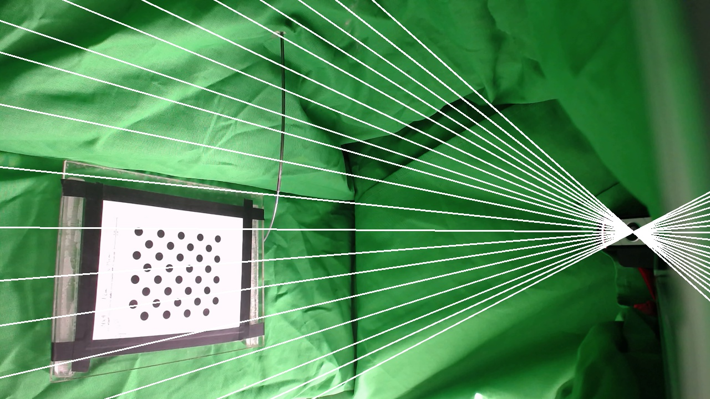

   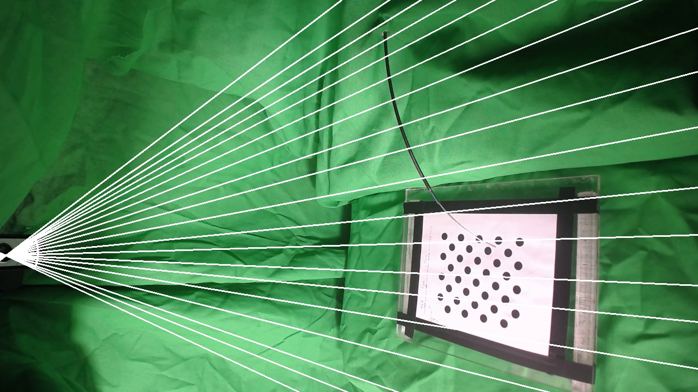

## Triangulation

Apply direct linear transformation (DLT) based on obtained geometric relation.

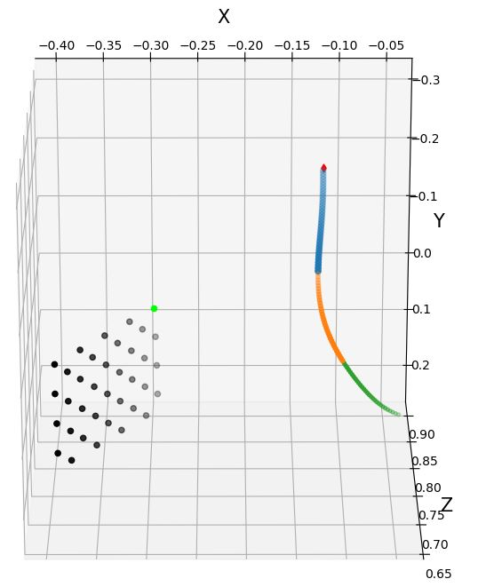

